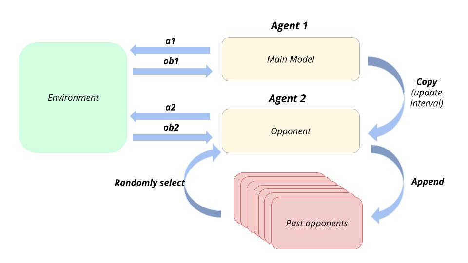
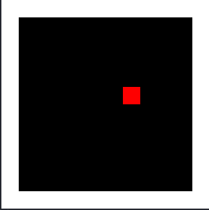
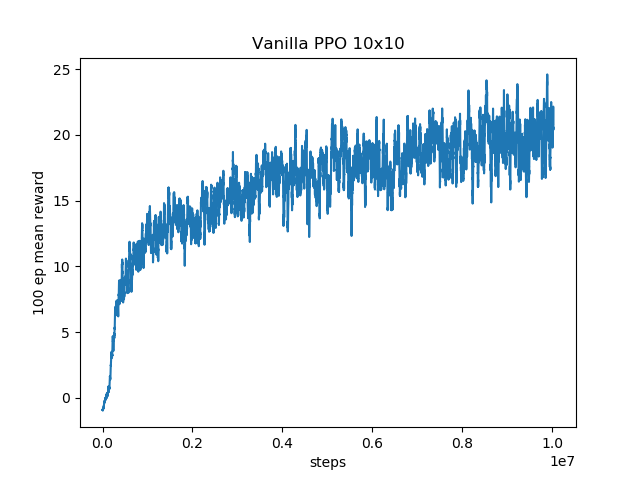
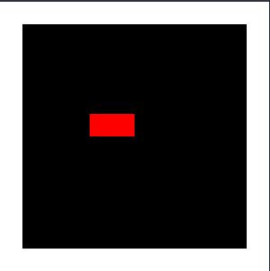
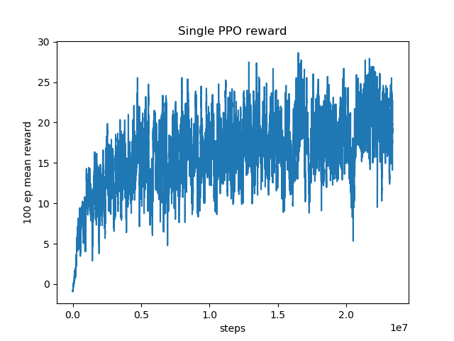

#Competitive Self-Play in Multi-Snakes Environment
By Jeewoo Kim, 1st year Student at Imperial College London

## Intro
Hi, I'm Jeewoo Kim and I'm a first year UG student at Imperial College London. 
This summer, I had a great opportunity to do a one month research at [Deep Learning Camp Jeju 2018](http://jeju.dlcamp.org/2018/),
which is organised by Tensorflow User Group and sponsored by big companies like Google, Kakao, Element AI, Netmarble...etc.
With the guidance of mentors and other mentees who have more experience into Deep Learning and Reinforcement Learning, 
I could successfully finish my project 'Competitive Self-Play in Multi-Snakes Environment'.
In this blog post, I would like to share some results of my one month project done at DL Camp Jeju 2018.

My project, 'Competitive Self-Play in Multi-Snakes Environment', 
was inspired by one of the research topic proposed in OpenAI's blogpost called ['Requests for Research 2.0'](https://blog.openai.com/requests-for-research-2/). 
The topic is called 'Slitherin', and it can be summarised as follows:
1) Set up a reasonably large field with multiple snakes. 
2) Solve the environment using self-play with some RL algorithms, and observe what happens.  
   e.g. train current policy against a distribution of past policies. 
3) Inspect the learned behavior. 

So, in this project, multiple versions of multi-snakes game environments 
and some famous Deep RL algorithms were implemented, 
and the agent was trained in these environments using self-play method.


## Motivation

Snake game is a very simple environment to train an agent using Reinforcement Learning.
But at the same time, it's really hard for an agent 
to be trained properly when the environment is too big,
because reward is very sparse. (For 20 by 20 grid, there will be only one reward (fruit) 
among 400 grids. There is 1/400 possibility for an agent to eat a fruit 
and get a positive reward. Since RL agent takes random movements when it starts training,
it will hardly get trained in 20 by 20 grid environment). 
We can also make the environment more diverse and complicated by adding more rules.
So this snake environment was best fit for me to do experiments step by step. 

In this project, my goals were:
1. Understand some Reinforcment Learning Algorithms (DQN, PPO)
2. Implement these algorithms in Tensorflow
3. Solve single snake environment using DQN, PPO
4. Solve multiple snakes environment using self-play method
5. Get some intuitions from the behaviours of the trained agents 

Thanks to Sourabh Bajaj, a mentor from Google Brain, for helping me choosing this topic. 


## Background
Assuming that some people are new to Reinforcement Learning, let me briefly explain 
some key concepts of Reinforcement Learning. 


In this project, I used Proximal Policy Optimization (PPO) algorithm from OpenAI's baselines code.

## Environment Setup
First of all, we need to make our own gym environment.
[OpenAI's gym repository](https://github.com/openai/gym/tree/master/gym/envs) 
has a good tutorial on this so please take a look at it. 
First, create directories as follow. 

```gym-snake/
  setup.py
  gym_snake/
    __init__.py
    core/
      __init__.py
    envs/
      __init__.py
      snake_single_env.py
      snake_multiple_env.py
```
'gym-snake' folder will be the main directory of this environment. 
gym-snake/setup.py should include
```
from setuptools import setup
setup(name='gym_snake',
      version='0.0.1',
      install_requires=['gym']  # And any other dependencies snake needs
)  
```
In gym-snake/gym_snake/__init__.py, you register your environments.
You can write down any names in id section. But this id will be called in the main file
when you use 'gym.make()' function to call your environment. 
In entry point, you must fill in the name of your environment class. 
The code must include this:
```
from gym.envs.registration import register

register(
    id='snake-single-v0',
    entry_point='gym_snake.envs:SnakeSingleEnv',
)
register(
    id='snake-multiple-v0',
    entry_point='gym_snake.envs:SnakeMultipleEnv',
)
```
Your environment code files should be in the 'envs' directory. 
gym-snake/gym_snake/envs/__init__.py is very similar to the __init__.py above.
```
from gym_snake.envs.snake_single_env import SnakeSingleEnv
from gym_snake.envs.snake_multiple_env import SnakeMultipleEnv
```

Lastly, your environment in 'gym-snake/gym_snake/envs/' must include these functions:
```python
import gym
from gym import error, spaces, utils
from gym.utils import seeding

class SnakeSingleEnv(gym.Env):
  metadata = {'render.modes': ['human']}
  
  def __init__(self):
    ...
  def step(self, action):
    ...
  def reset(self):
    ...
  def render(self, mode='human', close=False):
    ...
```
For this project, I made three snake environments: single snake, multiple snakes, multiple adversarial snakes. 
Single snake environment is identical to classic snake game. Multiple snakes environment
has multiple snakes with the rule that snake dies when its head collides to other snakes' body.
In multiple adversarial environment however, dead snake's body becomes fruits, which is inspired by the game called 'slither.io'.

In my environment, I made an additional folder called 'cores' to store codes used in all the directories. 


After setting up your environment, you should install your environment. All you need to do is 
```
cd gym-snake
pip3 install -e .
```
Now, you made your own environment! You can also add more rules to this snake game and create a new environment!

## My Self-Play Design

What is self-play? 
Self-play is a method to train AI by make them learn from playing both sides of the game using the same network.
For example, AlphaZero used one network to play both black and white, 

However, there is not much documents that clearly explains what self-play is, 

Let's start from the environment with two agents.
This is how we'll design our self-play method for this project: \


We have two models: main model and opponent model. 
Essentially, these two models are the same, but the only
difference is that opponent model is the past version of main model.
Main model plays agent 1, which will be the main agent
to be trained, while opponent model plays agent 2, 
which will be the opponent agent against the main agent.
Each agent gets an observation, which is different 
from the real environment: the agent itself is rendered 
as green, opponents are rendered as blue, fruits are rendered 
as red. We should do this, because main model and opponent model 
is essentially the same network, but if we give an input image of 
real environment, opponent model will confuse itself as a green snake 
not a blue snake, and will make a wrong decision. 
We're giving the raw image of the environment as an input, 
and the model will use Convolutional Neural Network 
to extract some features from it, and Proximal Policy Gradient to make decision. 

Main model is trained based on the reward it gets. 

On every update interval, the main model is copied
to the opponent model.

However, if we keep doing this, the main model will
get overfitted, because it will find a weak point
of the opponent model, and use that weak point to 
counter the opponent. 
So we train the main model against random old versions
of opponents to work better. 
Whenever the opponent model is updated, 
we store it to a list of opponent models and 
randomly sample old parameters for the opponent from the list. 
By doing this, the main model will be trained to
fight against diverse opponents, which will leads
to more stable training and more robus policies. 

## Experiments

I have conducted three experiments: 
training a single snake on 10 by 10 grid,
training a single snake on 19 by 19 grid,
and training three snakes on 10 by 10 grid using self-play.

For each experiment, I compared results of two algorithms:
Vanilla Proximal Policy Optimization (PPO) 
and Proximal Policy Optimization using self-play method.

1. Single Snake on 10 by 10 Grid Environment
Using Proximal Policy Optimization, after 10^7 iterations,
the agent was fully trained enough to reach the highest score
it can get in 10 by 10 environment. 



Using self-play method, it also gets really well trained.
However, if you look at the learning curve, you can see
that there are huge fluctuations going on. This is 
due to randomly sampling past versions of opponent models,
because the main model is not able to fight well
against the past versions of opponent models. 
But as you can see from the graph, the average reward
the agent gets gradually increases over time. 



By far, there isn't much difference using classic PPO and self-play PPO.
But when we increase the size of the grid world, problems happen.

2. Single Snake on 19 by 19 Grid Environment

In 19 by 19 grid world, there is only 1/361 probability
for an agent to eat fruit and get a positive reward.
Since the agent makes random movements at the beginning of training,
it's almost impossible for an agent to be trained well in this sparse reward environment.

Using classic PPO, we got this result:


You can see that the agent is not trained at all. 


## Results 


## Conclusions

## Acknowledgements
This project was supported by [Deep Learning Camp Jeju 2018](http://jeju.dlcamp.org/2018/) which was organized by [TensorFlow Korea User Group](https://facebook.com/groups/TensorFlowKR/).\
Special thanks to Eric Jang, Wolff Dobson, Sourabh Bajaj at Google Brain and Soonson Kwon at Google Korea. 
Everyone reading this blogpost must apply to next year's Deep Learning Camp Jeju. I can proudly say that this camp change my life. 

